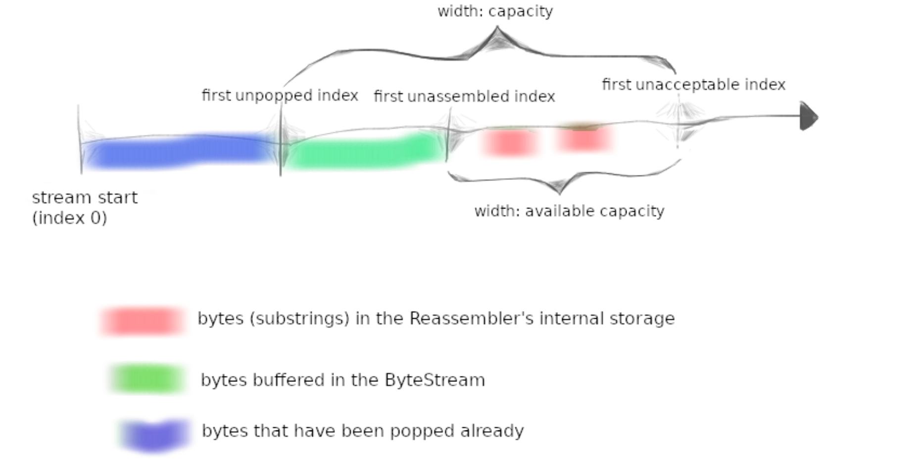

# TCP-IP-Protocol
斯坦福计算机网络课程项目，使用C++循序渐进地搭建出整个TCP/IP协议栈，实现IP路由以及ARP协议，最后用自己实现的协议栈代替Linux Kernel的网络协议栈和其他计算机进行通信
#### Lab0 实现简单的Web客户端和有序字节流类（内存管道）  2h(Clion+wsl) 2h 2h
#### Lab1 实现流重组器，将交叉重叠乱序的字节流重新组装成正确有序的字节流 6h

## Lab0 字节流
### 实现简单的Web客户端
编写webget，利用操作系统的TCP支持和流套接字抽象在互联网上获取网页的程序，使用HTTP请求格式向指定URL获取响应  
HTTP头部行尾以'\r\n'结尾，Connection: close指示服务器处理完当前请求后直接关闭
```c++
void get_URL(const string &host, const string &path) {
    TCPSocket socket;
    socket.connect(Address(host, "http"));
    socket.write("GET " + path + " HTTP/1.1\r\n" + "Host: " + host + "\r\n" + "Connection: close \r\n" + "\r\n");
    while (!socket.eof())
        cout << socket.read();
    socket.close();
}
```
注意：windows下git clone会把原本Linux项目的换行符改掉
```shell
sed -i -e 's/\r$//' webget_t.sh # 去掉\r
```
### 实现内存管道：有序字节流类
实现一个有序字节流类，可以往流中按字节写入数据在末尾，可以在流首部按字节读取数据  
可以使用队列实现流，用字节队列模拟字节流，有容量限制
```c++
    std::deque<char> buffer{};
    size_t _capacity = 0;
    size_t read_count = 0;
    size_t write_count = 0;
    bool ending = false;
```
如果写入数据大于流容量，则能够写多少就写多少
```shell
ByteStream::ByteStream(const size_t capacity) : _capacity(capacity) {}

size_t ByteStream::write(const string &data) {
    size_t data_size = data.size();
    if (data_size + buffer.size() > _capacity)
        data_size = _capacity - buffer.size();
    for (size_t i = 0; i < data_size; ++i)
        buffer.push_back(data[i]);
    write_count += data_size;
    return data_size;
}
```
读取的数据长度不能超过流的长度
```c++
//! \param[in] len bytes will be copied from the output side of the buffer
string ByteStream::peek_output(const size_t len) const {
    long read = min(len, buffer.size());
    return string().assign(buffer.begin(), buffer.begin() + read);
}

//! \param[in] len bytes will be removed from the output side of the buffer
void ByteStream::pop_output(const size_t len) {
    size_t out = min(len, buffer.size());
    read_count += out;
    while (out--)
        buffer.pop_front();
}
```
其他
```c++
void ByteStream::end_input() { ending = true; }

bool ByteStream::input_ended() const { return ending; }

size_t ByteStream::buffer_size() const { return buffer.size(); }

bool ByteStream::buffer_empty() const { return buffer.empty(); }

bool ByteStream::eof() const { return ending && buffer_empty(); }

size_t ByteStream::bytes_written() const { return write_count; }

size_t ByteStream::bytes_read() const { return read_count; }

size_t ByteStream::remaining_capacity() const { return _capacity - buffer.size(); }
```
## Lab1 字节流重组器
将交叉重叠乱序的字节流重新组装成正确有序的字节流，最简单粗暴的思想，用一个哈希表存储数据索引对应的字节，这样可以解决交叉重叠的问题，乱序可以从0开始查找写入流，哈希查找很快，但是插入删除很慢，实测1.24sec，同样改用红黑树映射，查找慢，但是插入删除快，实测1.83sec  
重组器装的是字节流类ByteStream里面已经重组好的字节流和等待重组的字节流  
无效数据：字节流尾部索引小于已重组数据索引，或者字节流首部索引大于已读数据索引+capacity

```c++
    size_t assembledIndex = 0;
    std::unordered_map<size_t, char> buffer{};
    bool ending = false;
```
```c++
void StreamReassembler::push_substring(const string &data, const size_t index, const bool eof) {
    if (_output.buffer_size() + buffer.size() == _capacity || index + data.size() < assembledIndex ||
        assembledIndex + _capacity - _output.buffer_size() <= index)
        return;
    size_t end = min(index + data.size(), assembledIndex + _capacity - _output.buffer_size());
    size_t start = max(assembledIndex, index);
    if (end == index + data.size() && eof)  // 如果能够完整写入末尾并且eof说明已经装上了eof
        ending = true;
    for (size_t i = start; i < end; ++i)
        buffer[i] = data[i - index];  // 数据本身索引需要和整体数据索引对应
    string segement;
    auto &&byte = buffer.find(assembledIndex);
    while (byte != buffer.end()) {
        segement += buffer[assembledIndex];
        buffer.erase(byte);
        byte = buffer.find(++assembledIndex);
    }
    if (!segement.empty())
        _output.write(segement);
    if (buffer.empty() && ending)  // 如果重组完所有片段并且收到了结尾片段
        _output.end_input();
}

size_t StreamReassembler::unassembled_bytes() const { return buffer.size(); }

bool StreamReassembler::empty() const { return buffer.empty(); }
```
优化思路：用索引映射字符需要大量的查找、插入和删除操作，可以存储每段字符串和其索引，这样以字符串为整体可以减少大量的字符插入和删除，交叉重叠的就进行合并，合并需要遍历存储的所有字符串区间判断是否存在交叉，考虑使用链表，而且本身链表插入删除就方便，并且如果按索引进行排序插入，查找可以使用二分
## Lab2 序列号和流量控制
将64位的流绝对索引转变成TCP报文中32位的序列号，为了安全序列号从一个随机号开始，因此流索引需要加上这个随机号再转换类型
```c++
WrappingInt32 wrap(uint64_t n, WrappingInt32 isn) { return WrappingInt32(static_cast<uint32_t>(n) + isn.raw_value()); }
```
同时需要将32位的序列号转换成64位的流绝对索引，这里提供的一个最近收到报文的64位流绝对索引checkpoint，可以用来确定当前报文的绝对位置，因为一般来说，两个报文的位置不会超过TCP序列号的范围，即2^32，所以可以先用上面的wrap计算出checkpoint的序列号，要求返回和checkpoint最近的一个索引，先算他们两个的序列号之差，肯定落在2^32的范围里面，如果差大于2^31，说明最近的索引不在同一个2^32里面
```c++
uint64_t unwrap(WrappingInt32 n, WrappingInt32 isn, uint64_t checkpoint) {
    uint32_t now = n.raw_value(), last = wrap(checkpoint, isn).raw_value();
    if (now < last) {
        uint32_t distance = last - now;
        if (distance > 1ul << 32 / 2 || checkpoint == 0)
            return checkpoint + (1ul << 32) - distance;
        return checkpoint - distance;
    }
    uint32_t distance = now - last;
    if (distance > 1ul << 32 / 2 && checkpoint)
        return checkpoint + distance - (1ul << 32);
    return checkpoint + distance;
}
```
注意：有符号短数和无符号长数运算时会先进行位扩展，即短变长，再进行符号的转变，即有符号变无符号